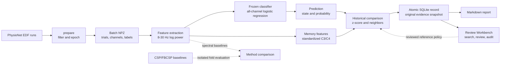
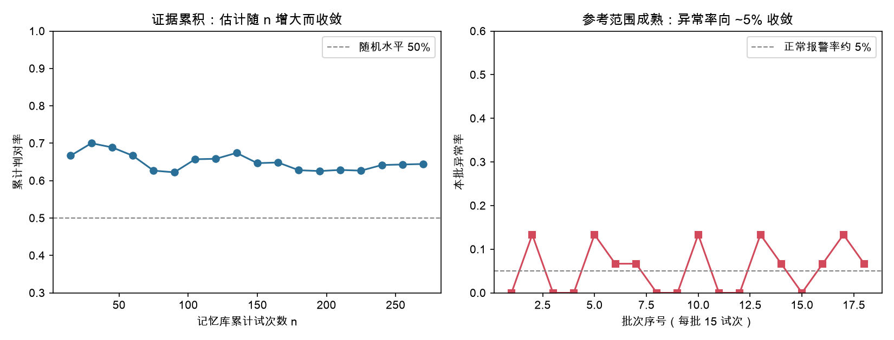

# EEG State Memory Assistant

A research prototype that classifies left- and right-hand motor imagery, compares
new EEG batches with earlier predictions, and saves an evidence report. The
classifier stays fixed after training. A separate SQLite database retains records
across restarts. A local review workbench adds searchable records, human
corrections and an audit trail while preserving the original model output.

## Run the project

Use Python 3.12. Run these commands from the repository root:

```bash
python -m venv .venv
source .venv/bin/activate
python -m pip install -r requirements.txt
python -m eegmem prepare
python -m eegmem train
python -m eegmem run
python -m eegmem stats
python -m eegmem evaluate
python -m eegmem workbench
```

`prepare` downloads about 74 MB of EDF recordings on first use and creates 30
batches. `train` uses subjects 1–4. `run` processes subjects 5–10 in subject/run
order, writes reports, and records each batch once. Repeating `run` restores
missing reports without duplicating memory. `evaluate` reproduces the metrics
and figure using independent models and an in-memory database. It includes
the C3/C4, all-channel, CSP and FBCSP comparisons.

| Output | Location |
| --- | --- |
| Downloaded EDF files and prepared batches | `data/mne_data/`, `data/subjects/` |
| Frozen model and feature metadata | `models/assistant.joblib` |
| Persistent records and report evidence | `data/assistant.sqlite3` |
| Local review copy and audit events | `data/workbench.sqlite3` |
| Per-batch reports | `reports/assistant/` |
| Reproducible evaluation | `results/metrics.json`, `figures/memory_growth.png` |

Downloaded data, trained models and individual reports stay local. The aggregate
evaluation and its figure are included in the repository.

## Memory review workbench

Open `http://127.0.0.1:8765` after starting `workbench`. Search by batch, reviewer
or note, filter the review queue, and inspect three similar records from earlier
batches. Review a label, exclude a record from future references, or reopen it.
Each action requires a reviewer name and evidence or a reason. Original
predictions and reports are preserved; every review remains in the audit log.

On first startup, the workbench copies `data/assistant.sqlite3` to
`data/workbench.sqlite3`. Later starts reuse that copy; it does not automatically
import new records from the original database. This keeps the benchmark history
separate from demonstrations. Analyze new batches into the workbench explicitly:

```bash
python -m eegmem run /path/to/new_run.npz --database data/workbench.sqlite3 --reference reviewed
```

`reviewed` uses only active human-reviewed labels. With no reviewed history, it
reports a cold start instead of silently substituting predictions. The default
`predicted` policy uses eligible model predictions plus human revisions. Both
policies exclude records marked for exclusion. Each new batch stores its source
record IDs, review versions and reference policy with the original evidence.
Later reviews do not rewrite that snapshot. Reprocessing a recorded batch under
a different policy is rejected.

This is a local single-user prototype. Reviewer names are self-reported, not
enterprise identities. Reviews affect memory references, not model parameters
or benchmark labels. Stored append-only review events are application audit
records, not tamper-proof storage. No large language model or company platform
integration is claimed.

## How it works

### Final architecture



The deployed path is the solid flow. CSP and FBCSP are research baselines in
an isolated comparison path; running the comparison does not replace the
deployed model or change the persistent memory. The classifier uses all-channel
features for prediction. The memory layer keeps C3/C4 because those features
have a stable, interpretable meaning across the historical records.

1. **Prepare signals.** Use subjects 1–10 and imagery runs 4, 8 and 12 from the
   [PhysioNet EEG Motor Movement/Imagery Dataset](https://physionet.org/content/eegmmidb/1.0.0/).
   Each recording has 64 channels sampled at 160 Hz. Filter to 7–30 Hz, extract
   trials from one second before to four seconds after each cue, and subtract
   the pre-cue mean. No automated artifact rejection is applied.
2. **Classify.** Compute the natural log of mean multitaper spectral power over
   8–30 Hz for each channel. Standardize each channel across the complete run.
   A training-fitted scaler and logistic regression predict left or right imagery.
   The [MNE multitaper implementation](https://mne.tools/stable/generated/mne.time_frequency.psd_array_multitaper.html)
   uses length normalization. These features are not baseline-relative ERD measurements.
3. **Compare.** Keep the standardized C3/C4 features for historical comparisons.
   For the predicted class, flag a trial if either channel lies more than two
   historical sample standard deviations from its mean. Require at least five
   records and nonzero variance. Three nearest historical predictions provide
   a separate agreement check, disabled for small or strongly imbalanced memory.
4. **Remember and report.** Every trial in a batch is compared against the same
   earlier history. Commit the batch and its evidence in one transaction, then
   render a Markdown report. Low model confidence is reported independently of
   the reference flag. A model fingerprint prevents mixing incompatible histories.

The classifier uses all channels for prediction; memory comparisons use two
named channels with a stable interpretation. Historical labels are predictions,
not verified ground truth. Agreement can repeat a model error and does not
validate a prediction.

## Research rationale

The project began with two C3/C4 spectral features and added all-channel
features to test whether a broader representation produced more consistent
results across subject groups. CSP and FBCSP provide explicit spatial-feature
comparisons. Their results are retained even when they do not improve this pilot.

Model selection and memory design answer different questions. The classifier
predicts imagery labels; external memory makes earlier observations available
for comparison, evidence accumulation and audit. Adding records does not change
the classifier's parameters. Keeping the two separate allows a different model
to be evaluated without redefining the stored C3/C4 reference features.

### Method comparison

| Method | Input representation | Role in the project | Five subject-pair folds | Decision |
| --- | --- | --- | --- | --- |
| C3/C4 spectral baseline | 2 run-standardized log-power features | Interpretable physiological baseline | 63.1% ± 7.6% | Retained for memory comparison |
| All-channel spectral model | 64 run-standardized log-power features | Deployed classifier | 62.7% ± 3.2% | Selected for the assistant |
| CSP | 6 spatial log-variance features | Spatial-feature baseline | 53.3% ± 3.4% | Retained as a documented comparison |
| FBCSP | 5 bands × 2 CSP features, 8 selected | Multi-band spatial baseline | 50.4% ± 8.0% | Retained as a documented comparison |

The scores are a controlled pilot comparison, not a universal ranking of EEG
methods. Every fold holds out two subjects, and CSP filters plus FBCSP feature
selection are fitted only on the training subjects. Full settings are in
[`experiments/README.md`](experiments/README.md).

### Three-minute demonstration

Run this sequence from the repository root after installing the dependencies:

```bash
# 1. Prepare the cached PhysioNet runs and create 30 self-contained batches.
python -m eegmem prepare

# 2. Train the frozen model on subjects 1-4.
python -m eegmem train

# 3. Reproduce all four method comparisons and the 174/270 pilot result.
python -m eegmem evaluate

# 4. Analyze subjects 5-10, write reports and grow the persistent memory.
python -m eegmem run
python -m eegmem stats

# 5. Open the local review workbench.
python -m eegmem workbench
```

For the spoken walkthrough, show `results/metrics.json` after step 3, then open
`figures/memory_growth.png`. Explain that the frozen model reaches 174/270 on
the held-out deployment split, while the memory records those predictions and
their historical reference evidence. In the browser, search for `S005R04`, open
one trial and show its C3/C4 values, nearest earlier records and review history.
If you record a review, enter a reviewer name and a reason; the original model
prediction remains visible and the event is appended to the audit history.

The demonstration shows a working research prototype. It does not claim a
real-time decoder, a clinical tool, an enterprise deployment or a completed
human-user study.

## Results

The pilot contains 450 trials from ten subjects. The fixed split trains on 180
trials from subjects 1–4 and evaluates 270 trials from subjects 5–10.

| Evaluation | Accuracy |
| --- | --- |
| C3/C4 features, five subject-pair folds | 63.1% ± 7.6% |
| All-channel features, same folds | 62.7% ± 3.2% |
| CSP, same five folds | 53.3% ± 3.4% |
| FBCSP, same five folds | 50.4% ± 8.0% |
| All-channel model, fixed split | 64.4%, 174/270 |

The five folds hold out pairs 1–2, 3–4, 5–6, 7–8 and 9–10 in turn. Reported spread
is the standard deviation across folds, not a confidence interval. The fixed
split and five-fold results reuse this pilot dataset; they are not independent
confirmation after model selection. Per-subject counts and exact fold scores
are saved in [results/metrics.json](results/metrics.json).

The all-channel baseline has a similar mean to C3/C4 and a smaller observed
spread across these folds. It remains the assistant's classifier. The spatial
baselines preserve the original custom implementation, including scale-dependent
regularization; their scores support this pilot decision, not a general claim
that CSP or FBCSP cannot transfer. See the [comparison protocol](experiments/README.md)
for settings, training boundaries and limitations.



The left panel tracks cumulative accuracy of a frozen model. More stored records
provide more evaluation evidence; they do not retrain or improve the classifier.
The right panel shows reference flags per incoming run. No fixed false-alarm
rate is assumed, and a flag does not establish a physiological abnormality.

## Scope and limitations

This is complete-run batch analysis, not real-time single-trial decoding. Run
normalization uses every trial in the incoming run without its labels. It can
change classification and suppress absolute between-run shifts, so these
results do not validate online drift detection. Pooling standardized runs also
does not establish physiological equivalence across people.

Trials within a subject are correlated. Ten subjects are a small pilot, and
additional trials from the same subjects do not substitute for independent
participants. Eye and muscle artifacts can remain. Model probabilities are
uncalibrated. The memory imbalance rule reduces one source of misleading votes
but cannot eliminate feedback bias. This prototype makes no clinical diagnosis
and does not identify fatigue or disease.

## Analyze another batch

```bash
python -m eegmem run /path/to/new_run.npz
```

Use a unique filename for each recording. The NPZ must contain `data` in volts
with trial/channel/time dimensions, `ch_names` in the training channel order,
and `sfreq`. Supply preprocessed epochs with the same time window and at least
two trials. Optional `labels` contain 0 for left imagery and 1 for right imagery;
without labels, reports omit accuracy. Known training files are rejected.

Changing the contents of an already recorded batch raises an error. A model
change also requires a separate memory database:

```bash
python -m eegmem run --database data/new_experiment.sqlite3
python -m eegmem stats --database data/new_experiment.sqlite3
```

## Code and checks

| Module | Responsibility |
| --- | --- |
| `eegmem/pipeline.py` | Data preparation and isolated four-method evaluation |
| `experiments/spatial.py` | Reproducible CSP/FBCSP research baselines |
| `eegmem/analyze.py` | Input validation, features, training and prediction |
| `eegmem/compare.py` | Reference ranges and neighbor agreement |
| `eegmem/memory.py` | Atomic persistence and model identity |
| `eegmem/report.py` | Reports from saved evidence |
| `eegmem/app.py` | Command line workflow |
| `eegmem/review.py` | Search, human review events and reference provenance |
| `eegmem/workbench.py` | Local review server and isolated database copy |
| `eegmem/web/` | Review interface |

```bash
python -m unittest discover -s tests -v
```
